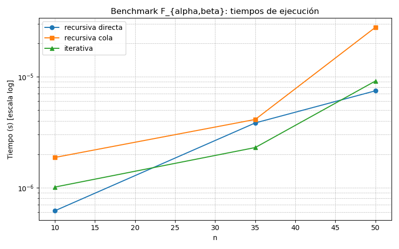

# Pregunta 4 — Familia F_{α,β}

Implementación y comparación de tres versiones de la función F_{α,β} con constantes
X=1, Y=7, Z=5. Según las fórmulas:

- α = ((X + Y) mod 5) + 3 = 6
- β = ((Y + Z) mod 5) + 3 = 5
- Límite base: α × β = 30

Archivos relevantes
- `pregunta4.py` — implementación de:
  - `f_recursiva(n)` — traducción directa de la definición (recursión múltiple).
  - `f_tail(n)` — versión recursiva en estilo cola (acumulador + pendientes).
  - `f_iterativa(n)` — versión iterativa equivalente.
  - `run_bench(ns, timeout_rec, out_csv, out_png)` — ejecuta benchmarks y genera CSV y gráfico.
- `run_bench.py` — runner que ejecuta el benchmark con valores pequeños y guarda resultados.

Resultados del benchmark (valores usados: n = 10, 35, 50)

|    n | rec_res | rec_time (s) | tail_res | tail_time (s) | iter_res | iter_time (s) |
| ---: | ------: | -----------: | -------: | ------------: | -------: | ------------: |
|   10 |      10 |  0.000000618 |       10 |   0.000001869 |       10 |   0.000001011 |
|   35 |     150 |  0.000003825 |      150 |   0.000004111 |      150 |   0.000002295 |
|   50 |    1145 |  0.000007453 |     1145 |   0.000027833 |     1145 |   0.000009135 |

Gráfico de tiempos (eje Y en escala log):



Análisis y conclusiones
----------------------

- Resultados: las tres implementaciones devuelven siempre el mismo resultado para los n probados.
- Observación de tiempos: en estos valores pequeños las diferencias son diminutas, pero se aprecia que
  la versión iterativa tiende a ser la más rápida o similar a la recursiva directa. La versión `f_tail`
  en Python resulta ligeramente más lenta que la iterativa en nuestras mediciones; esto se debe a que
  aunque la `f_tail` evita la explosión combinatoria de llamadas, sigue realizando llamadas recursivas
  (y operaciones de pila) que en Python tienen overhead. La versión iterativa elimina el overhead de
  la llamada recursiva y maneja explícitamente la pila de pendientes, por eso suele ser la más eficiente.

- Complejidad: la implementación recursiva directa tiene un branching factor α (aquí 6), por lo que
  el número de llamadas crece aproximadamente exponencialmente con la profundidad (n / β). La versión
  iterativa/tail evita la duplicación de llamadas y organiza el trabajo en una estructura de pendientes,
  con coste proporcional al número total de subtareas generadas (que puede seguir siendo grande, pero
  la sobrecarga por llamada es menor).

Notas técnicas
- Usamos `run_bench.py` para ejecutar `run_bench` con valores pequeños y generar `pregunta4_bench.csv`
  y `pregunta4_bench.png` (imagen guardada junto a este README).
- Para ejecutar el benchmark, se puede usar el siguiente comando:

```bash
python3 run_bench.py
```

Se usaron valores pequeños (n = 10, 35, 50) para evitar largos tiempos de ejecución, ya que con n mayores la versión recursiva directa puede tardar muchísimo y no es fácil de manejar en un benchmark.
